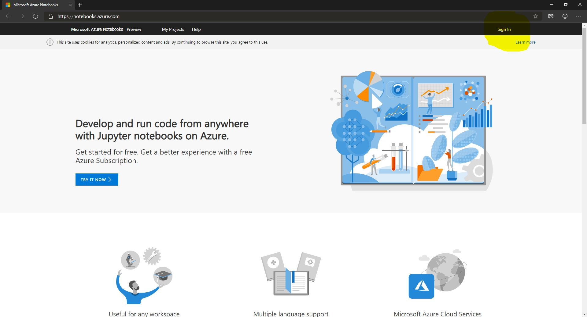
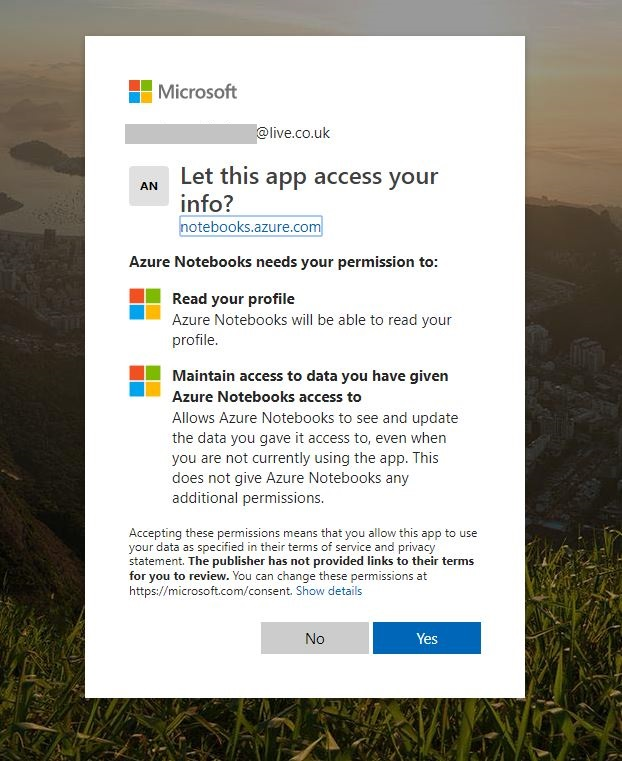
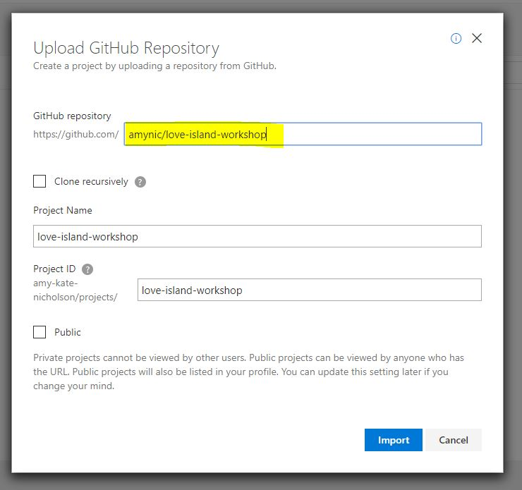

# Love Island Workshop
A repository containing all resources to learn about Python Data Visualisation and calling Machine Learning APIs (Text Analytics)

This workshop uses a personally collected Love Island TV series dataset about contestants from 2016 - 2019. Also some tweets collected during the show we can analyse.

* [Python Data Viz](#python-data-visualisation)
* [Machine Learning APIs](#calling-machine-learning-web-apis)

### So lets get started! ....

# Python Data Visualisation

Open the **love-island-workbook** file (.py if you are running in an IDE or .ipynb if you are running in a Jupyter Notebook environment) from the 'data vizualisation folder'.

This file contains pre-populated code to walk through step-by-step and understand and sections where you can write your own code and solve the challenges:

1. Can you filter the 'data' data frame where the OUTCOME field is equal to 'RUNNER UP'
2. Can you filter the 'data' data frame where the OUTCOME field is equal to 'THIRD PLACE'
3. Can we add a 3rd Violin plot for age distribution of Love Island 2016 contestants
4. Can you print the value counts of where the love island contestants live in the UK
5. Can you change the colours of the pie chart? - colours which are available available: [https://matplotlib.org/1.2.1/api/colors_api.html](https://matplotlib.org/1.2.1/api/colors_api.html)
6. Create your own scatter plot using the variables X1 - X6 and Y1 - Y10 to find correlations between variables

Feel free to add and run your own code within this file - this is your workbook space to try out what your learning about Data Visualisation

## If Running in Azure Notebooks [RECOMMENDED]

* Log into Azure Notebooks ([https://notebooks.azure.com/](https://notebooks.azure.com/)) using a Microsoft account **(email address such as hotmail, live, yahoo, Gmail etc)** and your password for that account

* Allow access to the service by selecting yes

* Create a user id - for example your alias (e.g amyboyd)

* Click 'My Projects' in the top left
* Create a new project from Github Repository by using the button below

* Clone the repository using the URL within the Green Button at the top of this repository

* Choose 'Run on Free Compute' and view the directory open in a Jupyter Interface 

* Click the 'love-island-workshop.ipynb' file to open
* run the notebook using control SHIFT + ENTER on each notebook cell

## If Running using Jupyter Locally

* Create a folder on your machine with the resources downloaded using the Green button at the top of this repository

* Run 'Jupyter' program on your local machine
* wait for the Jupyter server to start within the command line
* A web browser window should open with your documents
* Browse to the folder with the resources
* Select the 'love-island-workbook.ipynb' file and it will open in a new browser tab
* run the notebook using control SHIFT + ENTER

## If Running using VS Code

*  Create a folder on your machine with the resources downloaded using the Green button at the top of this repository

* Open Visual Studio Code and install the Python extension by Microsoft from the Extensions tab on the left
* Open the folder containing the code using File -> Open
* Double click the 'love-island-workbook.py' file to open it
* Once open to run the code choose SHIFT + ENTER or select a set of line of code, right click and run selected lines in Terminal

## If Running using Spyder

* Create a folder on your machine with the resources downloaded using the Green button at the top of this repository

* Open Spyder software
* File -> Open and navigate to the folder you just downloaded
* Open the Data Visualisation folder and select the 'love-island-workbook.py'
* Select small lines of code to run and select the 'Run Current Cell' button or SHIFT + ENTER

> If you are stuck feel free to look at the **love-island-completed-code** or **love-island-completed-notebook** files to see how I have solved the problem from the 'data vizualisation'

# Calling Machine Learning Web APIs

In this part of the workshop we are going to see how calling web APIs can help us expand the information we have in Python

> At this point we will sign up for Azure

First log into [Microsoft Azure](https://azure.microsoft.com/en-gb/?WT.mc_id=ainights-github-amynic) and choose **Portal** in the top right corner.

Once in the portal select **Create a resource** and search **Cognitive Services** and choose Enter. Then select **Create** on the Cognitive Services blade

Enter details to create an account:
* **Name:** enter a suitable name for the service (example: pythonwebapi)
* **Subscription:** Choose your subscription
* **Location:** Choose your closest Data Center available (example: North Europe)
* **Pricing Tier:** S0 or F0
* **Resource Group:** Select 'Create new', and provide a sensible name (example pythonworkshop)
* **select the checkbox after reading the terms below**
* **select 'Create'**

Once created, in your notifications (top right corner) select **go to resource**

In the Cognitive Services page, select **Keys** and copy **KEY 1**

Now select **Overview** in the left hand pane and copy the **Endpoint** variable

Once you have noted down your **key** and your **endpoint** - open the 'love-island-text-analytics.py' or 'love-island-text-analytics.ipynb' in your favourite IDE from the 'web apis' folder

Follow the instructions in the 2nd workbook to learn how to analyse a Love Island Tweet for sentiment and key phrases.
